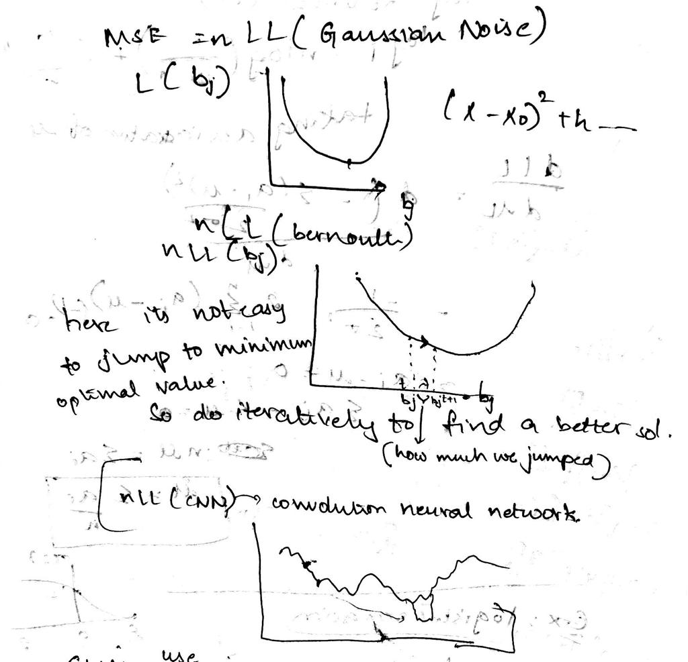
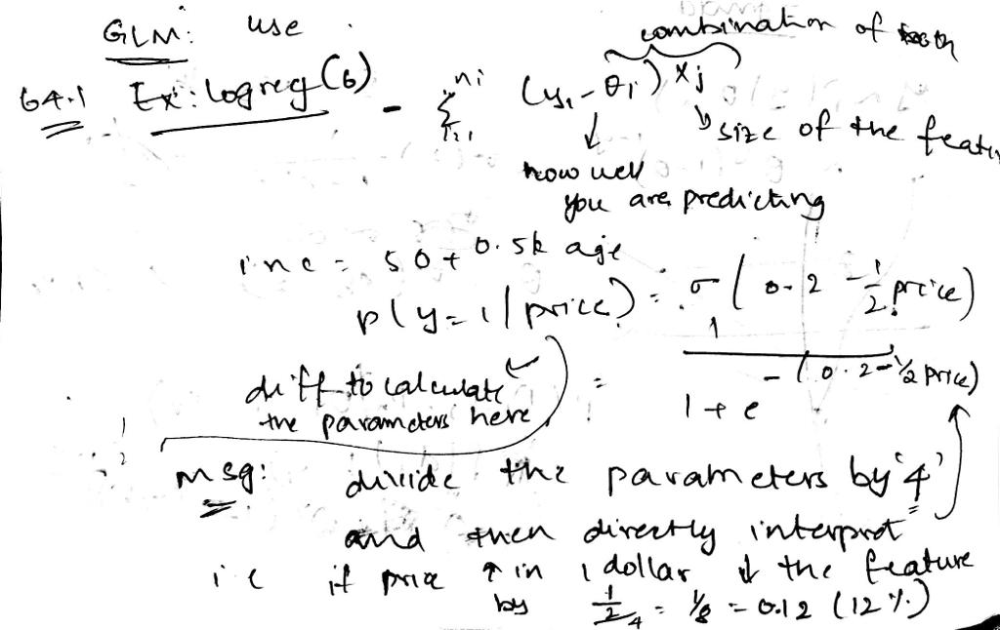

## Gradient descent

###### It is the idea where you cannot jump directly to optimal values i.e, in case of a linear regression, you can expect the the curve with the minimum point. But it is difficult to determine the optimal values as you keep increasing the level of machine learning algorithms and models say logistic regression, and later convolution neural network.

###### so, we we do the iterative process to obtain the optimal solutions





# Logistic regression: What can we do with our model?

- Interpretation is difficult:
$$p(y = 1 | x, b) = \sigma(b_0 + \sum_{j=1}^{m} b_j x_j) $$
- How can we interpret $b_j$?
- For example, suppose we can predict whether a customer buys a product based on its price in dollars:
$$p(\text{customer buys} | \text{price}) = \sigma(0.2 - \frac{1}{2} \text{price}) $$
- How to interpret the weight of price?

### it is difficult to calculate the parameters here.
###### hence, divide the parameters by '4' and then directly interpret i.e, if the price is increased in 1 dollar, decrease the feature by 1/8 (12%)


###### As we ge more into the complex models, it is more difficult to read the fearures.

### unsupervised Vs supervised

###### in unsupervised learning, it has to learn 2 functions but supervised has only one intermediate function to learn


```python

```
